# Container View

> C4 Level 2 — The single-process container and its internal module boundaries.

## Why Four Containers

In C4 terminology, a container is a separately deployable/runnable unit. VoxFlow has four containers:

1. **VoxFlow.Core** — shared .NET 9 class library containing all transcription services, interfaces, models, and DI registration. All business logic lives here.
2. **VoxFlow.Cli** — thin console application host that uses Core via dependency injection
3. **VoxFlow.McpServer** — MCP server host that injects Core interfaces directly for AI client access over stdio transport
4. **VoxFlow.Desktop** — macOS MAUI Blazor Hybrid desktop application that provides a visual transcription workflow using Core services

All three host projects share `VoxFlow.Core` through a single `AddVoxFlowCore()` DI registration entry point. Host projects contain only host-specific concerns: CLI argument handling, MCP transport/security, or Blazor UI pages.

## Container Diagram

```mermaid
flowchart TB
    subgraph core_lib["VoxFlow.Core (shared library)"]
        direction TB

        subgraph core_interfaces["Service Interfaces"]
            ifaces["ITranscriptionService<br/>IValidationService<br/>IConfigurationService<br/>IBatchTranscriptionService<br/>ITranscriptReader"]
        end

        subgraph config_layer["Configuration Layer"]
            options["TranscriptionOptions<br/><i>Immutable runtime config<br/>from JSON + env override</i>"]
        end

        subgraph validation_layer["Validation Layer"]
            startup["StartupValidationService<br/><i>Preflight checks with<br/>pass/warn/fail/skip</i>"]
        end

        subgraph processing["Processing Layer"]
            convert["AudioConversionService<br/><i>ffmpeg process management</i>"]
            loader["WavAudioLoader<br/><i>PCM parsing + normalization</i>"]
            model["ModelService<br/><i>Model loading + download</i>"]
            lang["LanguageSelectionService<br/><i>Inference + candidate scoring</i>"]
            filter["TranscriptionFilter<br/><i>Segment acceptance rules</i>"]
        end

        subgraph output_layer["Output Layer"]
            writer["OutputWriter<br/><i>Timestamped transcript files</i>"]
            discovery["FileDiscoveryService<br/><i>Batch file enumeration</i>"]
            summary["BatchSummaryWriter<br/><i>Batch result reports</i>"]
        end

        subgraph di_reg["DI Registration"]
            addcore["AddVoxFlowCore()<br/><i>Single entry point for<br/>all service registration</i>"]
        end
    end

    subgraph cli_container["VoxFlow.Cli Process (.NET 9)"]
        direction TB
        cli_program["Program.cs<br/><i>Entry point, flow control,<br/>cancellation, exit codes</i>"]
        cli_progress["ConsoleProgressService<br/><i>ANSI progress bar + spinner</i>"]
    end

    subgraph mcp_container["VoxFlow.McpServer Process (.NET 9)"]
        direction TB

        subgraph mcp_host["MCP Host Layer"]
            mcp_program["Program.cs<br/><i>DI composition root,<br/>stdio transport setup</i>"]
        end

        subgraph mcp_tools["MCP Tool Layer"]
            tools["WhisperMcpTools<br/><i>6 MCP tools</i>"]
            resources["WhisperMcpResourceTools<br/><i>Configuration inspector</i>"]
            prompts["WhisperMcpPrompts<br/><i>4 guided workflows</i>"]
        end

        subgraph mcp_security["Security Layer"]
            pathpolicy["PathPolicy<br/><i>Input/output root enforcement</i>"]
        end

        subgraph mcp_config["Configuration"]
            mcp_options["McpOptions<br/><i>Server identity, path policy,<br/>batch limits, logging</i>"]
        end
    end

    subgraph desktop_container["VoxFlow.Desktop Process (.NET 9 MAUI Blazor Hybrid)"]
        direction TB
        desktop_vm["AppViewModel<br/><i>Application state management</i>"]
        desktop_pages["Blazor Pages<br/><i>Welcome, FileSelect,<br/>Transcription, Result, Settings</i>"]
    end

    subgraph external["External Dependencies"]
        ffmpeg["ffmpeg process"]
        whisper["Whisper.net<br/>+ libwhisper native"]
        fs["Local File System"]
    end

    subgraph clients["AI Clients"]
        ai["Claude / ChatGPT /<br/>GitHub Copilot / VS Code"]
    end

    cli_program -->|DI| addcore
    mcp_program -->|DI| addcore
    desktop_vm -->|DI| addcore

    cli_program --> cli_progress
    ai -->|stdio MCP| mcp_program
    mcp_program --> mcp_options
    tools --> pathpolicy
    tools --> ifaces

    desktop_pages --> desktop_vm
    desktop_vm --> ifaces

    ifaces --> startup
    ifaces --> convert
    ifaces --> model
    ifaces --> lang
    ifaces --> writer

    lang --> filter

    convert -.->|spawns| ffmpeg
    model -.->|P/Invoke| whisper
    lang -.->|P/Invoke| whisper
    startup -.->|probes| ffmpeg
    startup -.->|probes| whisper

    options -.->|reads| fs
    convert -.->|reads/writes| fs
    loader -.->|reads| fs
    model -.->|reads/writes| fs
    writer -.->|writes| fs
    discovery -.->|reads| fs
    summary -.->|writes| fs
```



## Module Boundary Rules

The internal structure follows these conventions:

| Rule | Enforcement |
|------|-------------|
| **Host projects delegate to Core interfaces.** No host project contains business logic — only host-specific concerns (CLI output, MCP transport, Blazor UI). | By convention; visible in project references |
| **All service registration goes through `AddVoxFlowCore()`.** Hosts must not register Core services individually. | By convention; single DI entry point |
| **Configuration is immutable after load.** TranscriptionOptions is sealed with read-only properties. No module modifies configuration at runtime. | Compiler-enforced (sealed class, init-only properties) |
| **External process calls are confined to AudioConversionService.** Only one module spawns child processes. | By convention |
| **Native runtime calls are confined to ModelService and LanguageSelectionService.** Whisper.net is used through WhisperFactory, not directly by other modules. | By convention |
| **File system writes are confined to OutputWriter, BatchSummaryWriter, and ModelService.** Other modules read but do not write files. | By convention |
| **Progress reporting uses `IProgress<ProgressUpdate>`.** Core services must not reference console, Blazor, or any host-specific output mechanism. | Compiler-enforced (Core has no host dependencies) |

## Shared Core with Dependency Injection

With three host projects (CLI, MCP Server, Desktop), all transcription logic has been extracted into `VoxFlow.Core` as instance-based services implementing interfaces. The previous static services and application facades have been replaced.

**Why DI is now justified:**
- Three hosts need the same services — duplication or `InternalsVisibleTo` hacks are worse than a shared DI registration
- `AddVoxFlowCore()` provides a single entry point for all service registration, ensuring consistent behavior across hosts
- Interfaces (`ITranscriptionService`, `IValidationService`, etc.) enable mock-friendly testing
- `IProgress<ProgressUpdate>` allows each host to render progress in its own way (console ANSI, Blazor UI, etc.)

**What changed from the previous architecture:**
- Static services replaced with instance-based DI services implementing interfaces
- Application facades eliminated — MCP server injects Core interfaces directly
- `InternalsVisibleTo` removed — all types consumed by hosts are public in `VoxFlow.Core`
- Each host project contains only host-specific concerns (entry point, transport, UI)

## Layer Interactions

```
  Host (CLI / MCP / Desktop)
       │
       ├── AddVoxFlowCore()    registers all Core services
       │
       └── Core Interfaces     host calls service interfaces via DI
               │
               ├── Configuration    loaded once, passed as parameter
               │
               ├── Validation       runs before processing, reads config
               │
               ├── Processing       sequential stages, each stage independent
               │       │
               │       └── filter is called by language service (not orchestrator)
               │
               ├── Output           writes results after processing completes
               │
               └── Progress         IProgress<ProgressUpdate> → host-specific rendering
```

Each host project drives control flow through Core service interfaces. Processing layer modules do not call each other except for the LanguageSelectionService → TranscriptionFilter dependency, which represents a direct pipeline stage relationship (inference produces segments, filter accepts/rejects them). Progress reporting flows from Core to host via `IProgress<ProgressUpdate>`, allowing each host to render progress appropriately (console ANSI for CLI, Blazor UI updates for Desktop, suppressed for MCP).
